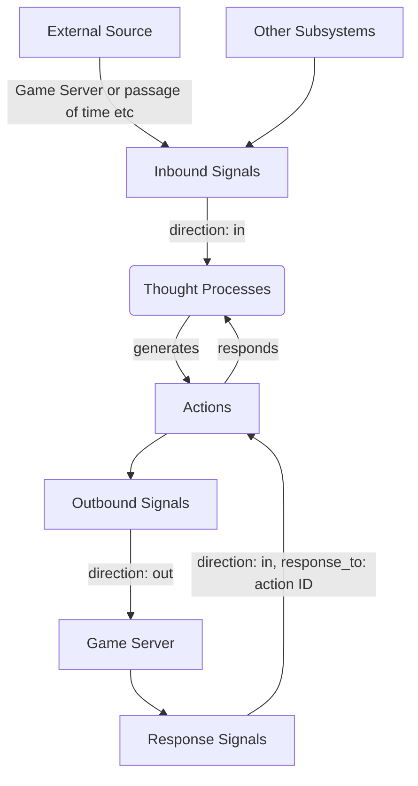

# StoryWeaver
This is the Story Weaver brain and control UI.

## Local Development
1. Start local Supabase by running `supabase start` (must have [Supabase CLI](https://supabase.com/docs/guides/cli/getting-started) installed)
2. Run `yarn dev`

## Thinking Architecture (note: this is outdated, from the old project)
The AI is composed of several GPT-based agent "subsystems", orchestrated using "signals". Each subsystem can influence the game world, and retrieve data using "actions".

Example subsystems:
- Storyteller: Gathers information about the world and available capabilities, and generates a storyline. Adapts a storyline with new data as needed.
- Mission Builder: Takes a storyline and generates one or more mission graphs, with objectives for players and NPCs.
- Action Analyzer: Analyzes complex player actions to interpret intent and potentially activate triggers set in place by Mission Builder.
- Character Builder: Generates characters with personalities and backstories dynamically, at the request of other subsystems.
- Playwright: Generates dialogue for characters dynamically, taking into account local environment.

When an inbound signal message is received, a "Thought Process" is created for that subsystem, which is a series of signals and actions, in a Q&A format, to respond to the initial signal, terminated by exausting necessary actions.
- Subsystems can communicate to each other using actions that create inbound signals.
- Subsystems can communicate with the game server using actions that create outbound signals.
- Subsystems can receive responses from the game server (confirmations of action, or some information retrieval, for example) with actions that watch for inbound response signals (where the `response_to` SQL column is set to the action's ID).

